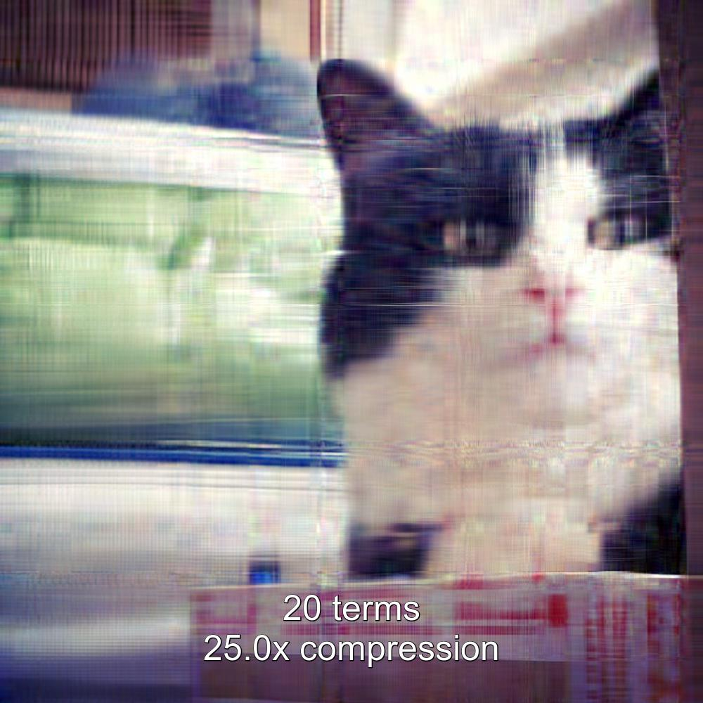

# A Python image compression program

This a Python program I wrote for fun to apply linear algebra theory I learned in Monash uni. The code uses singular value expansion method to reduce the size of an image.

## Setup

Install the dependencies:

```
pip install numpy
pip install imageio
```

## Usage


### Compress all images in a directory

This following program allows to compress many images with different quality, which is controlled by the `terms` setting. This can be useful for comparing many different outcomes and see how the `terms` setting affects image quality.

Run from the project directory:

```
$ python src/process_samples.py INPUT_DIR OUTPUT_DIR
```

Replace `INPUT_DIR` with the name of directory that contains images you want to compress, in JPG, PNG or BMP format. All images in the directory will be compressed.

Replace `OUTPUT_DIR` with a name of the directory where you want compressed images to be placed.


##### Example

This example uses the images of my cat Marmite from images/for_compression directory:

```
$ python src/process_samples.py images/for_compression images/compressed/

Creating images:
images/compressed/100x100/marmite_100x100_1_terms_49.8x_compression.jpg
images/compressed/100x100/marmite_100x100_2_terms_24.9x_compression.jpg
images/compressed/100x100/marmite_100x100_5_terms_10.0x_compression.jpg
images/compressed/100x100/marmite_100x100_10_terms_5.0x_compression.jpg
images/compressed/100x100/marmite_100x100_20_terms_2.5x_compression.jpg
```

The program produced the following compressed images (see images of other sizes [here](images/compressed)):





## Run unit tests

Install `pytest`

```
pip install pytest
```

and run the unit tests:

```
pytest
```


## The unlicense

This work is in [public domain](LICENSE).

